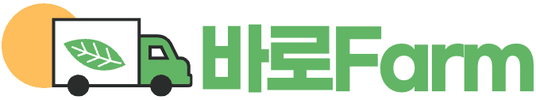

 

  

 

##   
 소규모 농수산물 생산자와 도시의 소비자를 직접 연결하는 스마트 거래 플랫폼 , 바로Farm 🌱 
  

### 기존 React + JS로 만들었던 프로젝트를 Next.js + TS로 마이그레이션합니다.

 

### 🔗 관련 링크

<b> 배포 주소: [바로Farm 링크](https://barofarm.netlify.app/)</b>

<b> 피그마(Figma): [피그마 링크](<https://www.figma.com/design/ThTdy4bAI2dDMxaRcDPFAW/4%EB%94%B8%EB%9D%BC---%EB%B0%94%EB%A1%9C%ED%8C%9C(Farm)?node-id=0-1&p=f&t=O2YRQAev0xPoQLzn-0>)</b>

<b> 기능정의서: [기능정의서 링크](https://docs.google.com/spreadsheets/d/12brCwjbi5Jx5qKoXahrMsqFkfG7VHe_1B374fup5QQg/edit?gid=0#gid=0)</b>

<b> 노션(Notion): [노션 링크](https://www.notion.so/4-4-3275fa56674041069f61c44806d2d11e?pvs=4)</b>

 

### ⚙️ 기술 스택

  <!-- 개발 도구 -->
  
  
  
  
  <!-- 빌드 도구 -->
  
  <!-- 프론트엔드 기본 기술 -->
  
  
  
  <!-- 프레임워크 및 스타일링 -->
  
  
  <!-- 상태 관리 및 데이터 페칭 -->
  
  
  <!-- 라우팅 -->
  
  <!-- 배포 -->
  

 
 

### 📆 개발 기간

<b>25.03.08 - 진행중 : 앱 라우터로 페이지 마이그레이션 + 데이터 페칭 전략 변경(axios -> fetch API)</b>
